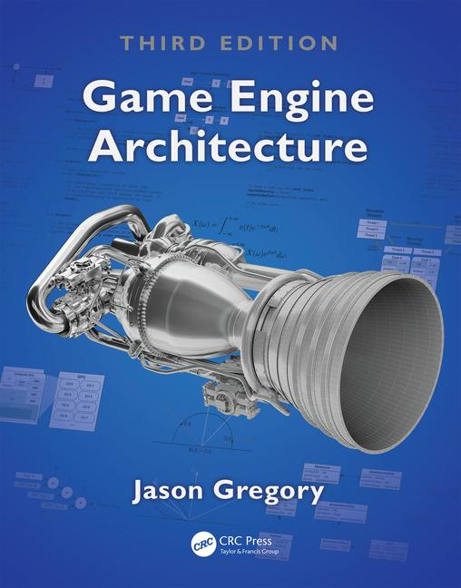

# CS425 Fall 2019: Game Programming 1

## Information
- Time: Monday and Wednesday, 12:00 pm - 1:15 pm 
- Location: Art and Design Building L008

- [Course HomePage](https://github.com/jmlien/CS425-2019)
- [Lecture schedule](lectures)
- [Programming assignments](assignments)
- [Syllabus](https://cs.gmu.edu/media/syllabi/Fall2019/Game_Programming_1LienJ.html)

## Instructor

- [Jyh-Ming Lien](http://cs.gmu.edu/~jmlien)
- jmlien@cs.gmu.edu
- Office: ENGR 4442
- Office hours: Wednesdays 2~3:30pm

## Required Textbook

Game Engine Architecture by Jason Gregory. 3rd Edition. ISBN# 9781315267845.

Note: GMU students have full access to the [ebook](https://www-taylorfrancis-com.mutex.gmu.edu/books/9781315267845)

## Useful links
- [Sylvester Matrix/Vector js code](http://sylvester.jcoglan.com/)
- http://soundbible.com/
- http://opengameart.org/
- http://www.google.com/fonts/
